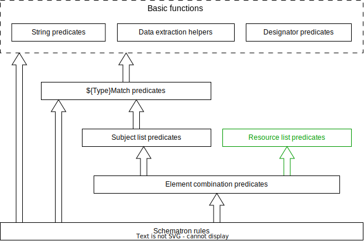
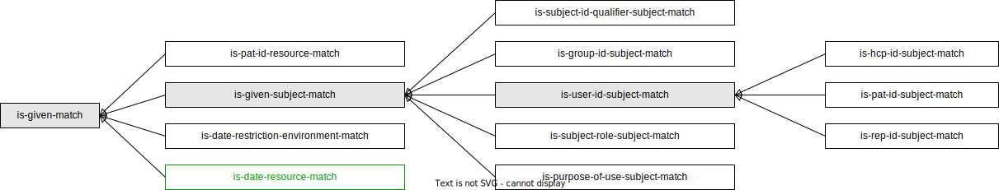

# Official EPR Policy Stack

*Author: [Dmytro Rud](mailto:dmytro.rud@gmail.com), last change: 16-Aug-2023.*

According to chapter 4 of amendment 2.1 of annex 5 [EPRO-FDHA](https://www.fedlex.admin.ch/eli/oc/2023/221/de/annexes),
the official EPR [policy stack](https://github.com/ehealthsuisse/ch-epr-adr-ppq/tree/main/Privacy%20Policy%20Stack)
consists from:

* base policies,
* base policy sets,
* templates for patient bootstrap policy sets,
* templates for patient user assignment policy sets.

Their format is the Extensible Access Control Markup Language ([XACML](https://www.oasis-open.org/standard/xacmlv2-0/))
version 2.0.

The given document aims at describing structures of EPR policies and policy sets (intentionally not as detailed as
in the official XACML specification referenced above), relationships among them, and the Schematron script used
for the validation of the policy sets generated from the templates mentioned in the two last bullet points.

## 1. Structure of policies and policy sets

Each policy or policy set has the following elements:

* ID of the policy or policy set — must be a UUID in URN format.
* A set of so-called "target constraints" determining whether a given policy or policy set shall be evaluated when
  making the access decision for a given request. These constraints can apply to:
    * Resources — objects being tried to be accessed or manipulated,
    * Actions — actions being tried to be performed on the resources,
    * Subjects — users trying to perform these actions,
    * Environments — circumstances under which the request occurs.
* An optional additional condition.
* Effect, i.e. whether the access shall be denied or granted when all constraints are met.
* ID of the combining algorithm which determines how the Authorization Decision Provider shall combine effects
  of all evaluated policies and policy sets when making the final access decision. In EPR, this value is
  always `urn:oasis:names:tc:xacml:1.0:rule-combining-algorithm:deny-overrides`, which means that a decision to deny
  the access overrules any other decisions.

Additionally, policy sets may reference and/or embed other policies or policy sets that will be evaluated recursively.

### 1.1. Structure of target constraints

This subsection describes how target constraints are defined in XACML policies and policy sets. In these descriptions,
the placeholder `${Type}` will be used to represent one of the following values, correspondingly to the possible
objects of target constraints:

* `Resource`,
* `Action`,
* `Subject`,
* `Environment`.

The XACML element `Target` of a policy or policy set contains sub-elements named after plural
forms of `${Type}`, i.e. `Resources`, `Actions`, `Subjects`, and `Environments`. Each of them consists
from *1–n* sub-elements `${Type}` (in singular), and they, on their part —
from *1–m* sub-elements `${Type}Match`. For example:

```xml

<xacml:PolicySet xmlns:xacml="urn:oasis:names:tc:xacml:2.0:policy:schema:os"
                 PolicyCombiningAlgId="urn:oasis:names:tc:xacml:1.0:policy-combining-algorithm:deny-overrides"
                 PolicySetId="urn:uuid:58bbfa76-4d65-4fa1-b0af-c862b52a20d4" Version="1.0">
    <xacml:Target>
        <xacml:Subjects>
            <xacml:Subject>
                <xacml:SubjectMatch.../>
            </xacml:Subject>
            <xacml:Subject>
                <xacml:SubjectMatch.../>
                <xacml:SubjectMatch.../>
                <xacml:SubjectMatch.../>
            </xacml:Subject>
        </xacml:Subjects>
        <xacml:Resources>
            <xacml:Resource>
                <xacml:ResourceMatch.../>
            </xacml:Resource>
        </xacml:Resources>
        <xacml:Environments>
            <xacml:Environment>
                <xacml:EnvironmentMatch.../>
                <xacml:EnvironmentMatch.../>
            </xacml:Environment>
        </xacml:Environments>
    </xacml:Target>
    <xacml:PolicySetIdReference>urn:e-health-suisse:2015:policies:tralala</xacml:PolicySetIdReference>
</xacml:PolicySet>
```

All elements `${Type}Match` have the same purpose and the same structure — they define, how a so-called
"designated attribute" (a part of the policy evaluation context, e.g. a value contained in the CH:ADR request)
shall be matched against a specified expected value. In that way, each of the elements `${Type}Match` contains:

* A match ID, i.e. a name of the comparator function to be applied — attribute `@MatchID`.
* A fixed expected value of the designated attribute — sub-element `AttributeValue`. It will
  be used as the first parameter of the comparator function.
* A definition of the designated attribute, consisting from the attribute ID and data type — sub-element
  `${Type}AttributeDesignator`. The actual value of this attribute will be determined dynamically when evaluating the
  policy or policy set and used as the second parameter of the comparator function. The data type must match the one of
  the expected value.

For example, the following definition prescribes to apply the function `urn:hl7-org:v3:function:II-equal`
(comparator of HL7v3 instance identifiers) on two parameters of the type `urn:hl7-org:v3#II` — the value of the
evaluation context attribute named `urn:e-health-suisse:2015:epr-spid` and the instance identifier
`761337612483458721` with the assigning authority OID `2.16.756.5.30.1.127.3.10.3`.

```xml

<xacml:ResourceMatch MatchId="urn:hl7-org:v3:function:II-equal">
    <xacml:AttributeValue DataType="urn:hl7-org:v3#II">
        <InstanceIdentifier xmlns="urn:hl7-org:v3" extension="761337612483458721"
                            root="2.16.756.5.30.1.127.3.10.3"/>
    </xacml:AttributeValue>
    <xacml:ResourceAttributeDesignator AttributeId="urn:e-health-suisse:2015:epr-spid" DataType="urn:hl7-org:v3#II"/>
</xacml:ResourceMatch>
```

The order of sub-elements `${Type}Match` inside of an element `${Type}` as well as the order of elements `${Type}`
inside of `${Type}s` does not matter.

There is a logical conjunction among sub-elements `${Type}Match` of the same `${Type}`, and a logical
disjunction among elements `${Type}` of the same policy or policy set. In that way, a policy set will become relevant
for producing an access decision only if all sub-elements `SubjectMatch` in at least one element `Subject` of this
policy set will resolve to `true`, and the same for `Action`, `Resource`, and `Environment`.

Elements `SubjectMatch` used in EPR policies and policy sets can be furthermore classified as matchers of:

* group IDs (OIDs),
* subject IDs (GLNs, EPR-SPIDs, representative's IDs),
* subject ID qualifier codes (person ID types),
* subject role codes,
* purpose of use codes.

Each of them has a specific fixed combination of match ID, designated attribute, and data type. Depending on the target
subject type, an element `Subject` may contain up to three elements `SubjectMatch` addressing different criteria
of the subject identification — for example, the following definition will match a user in the role "patient",
who has an ID "761384759483458721" of the type "EPR-SPID":

```xml

<xacml:Subject>
    <xacml:SubjectMatch MatchId="urn:oasis:names:tc:xacml:1.0:function:string-equal">
        <xacml:AttributeValue DataType="http://www.w3.org/2001/XMLSchema#string">761384759483458721
        </xacml:AttributeValue>
        <xacml:SubjectAttributeDesignator AttributeId="urn:oasis:names:tc:xacml:1.0:subject:subject-id"
                                          DataType="http://www.w3.org/2001/XMLSchema#string"/>
    </xacml:SubjectMatch>
    <xacml:SubjectMatch MatchId="urn:oasis:names:tc:xacml:1.0:function:string-equal">
        <xacml:AttributeValue DataType="http://www.w3.org/2001/XMLSchema#string">urn:e-health-suisse:2015:epr-spid
        </xacml:AttributeValue>
        <xacml:SubjectAttributeDesignator AttributeId="urn:oasis:names:tc:xacml:1.0:subject:subject-id-qualifier"
                                          DataType="http://www.w3.org/2001/XMLSchema#string"/>
    </xacml:SubjectMatch>
    <xacml:SubjectMatch MatchId="urn:hl7-org:v3:function:CV-equal">
        <xacml:AttributeValue DataType="urn:hl7-org:v3#CV">
            <CodedValue xmlns="urn:hl7-org:v3" code="PAT" codeSystem="2.16.756.5.30.1.127.3.10.6"/>
        </xacml:AttributeValue>
        <xacml:SubjectAttributeDesignator AttributeId="urn:oasis:names:tc:xacml:2.0:subject:role"
                                          DataType="urn:hl7-org:v3#CV"/>
    </xacml:SubjectMatch>
</xacml:Subject>
```

## 2. Overview and relations among EPR policies and policy sets

Relations among EPR base policies, base policy sets, policy set templates, and user-defined policy sets generated from
these templates can be represented graphically in the following way (IDs of base policies and base policy sets are given
in a shortened form, without the common prefix `urn:e-health-suisse:2015:policies:`):


Detailed descriptions of the elements of the EPR Official Policy Stack will be provided in the subsequent
sections. Target constraints of policies and policy sets will be represented as lists of allowed
document confidentiality codes, purposes of use, and user roles.

The following notational conventions apply:

* Asterisk `*` means that the target constraints do not address the corresponding attribute, i.e. that there is no
  restriction of its values.
* If a policy set references multiple policies or policy sets simultaneously, their IDs are separated by commas.
* If a policy set references a single policy or policy set from a list of alternatives, their IDs are separated by "or".
* If the target constraints of a policy set vary depending on which policies or policy sets it references, the syntax
  "ID of the referenced policy or policy set 🡒 resulting value" is used, e.g. "102 🡒 `NORMAL`".

### 2.1. Base policies

**Base policy 01:**

- File name: 01-base-policy-read-normal.xml
- Policy ID: `urn:e-health-suisse:2015:policies:permit-reading-normal`
- Effect: Permit to enquire document metadata and content
- Allowed document confidentiality code(s): `NORMAL`
- Allowed purpose(s) of use: `NORM`, `EMER`
- Allowed user role(s): All excluding `TCU` (note 1)

**Base policy 02:**

- File name: 02-base-policy-read-restricted.xml
- Policy ID: `urn:e-health-suisse:2015:policies:permit-reading-restricted`
- Effect: Permit to enquire document metadata and contents
- Allowed document confidentiality code(s): `RESTRICTED`
- Allowed purpose(s) of use: `NORM`, `EMER`
- Allowed user role(s): All excluding `TCU` (note 1)

**Base policy 03:**

- File name: 03-base-policy-read-secret.xml
- Policy ID: `urn:e-health-suisse:2015:policies:permit-reading-secret`
- Effect: Permit to enquire document metadata and contents
- Allowed document confidentiality code(s): `SECRET`
- Allowed purpose(s) of use: `NORM`, `EMER`
- Allowed user role(s): All excluding `TCU` (note 1)

**Base policy 04:**

- File name: 04-base-policy-write-normal.xml
- Policy ID: `urn:e-health-suisse:2015:policies:permit-writing-normal`
- Effect: Permit to submit documents
- Allowed document confidentiality code(s): `NORMAL`
- Allowed purpose(s) of use: `*`
- Allowed user role(s): `*`

**Base policy 05:**

- File name: 05-base-policy-write-restricted.xml
- Policy ID: `urn:e-health-suisse:2015:policies:permit-writing-restricted`
- Effect: Permit to submit documents
- Allowed document confidentiality code(s): `RESTRICTED`
- Allowed purpose(s) of use: `*`
- Allowed user role(s): `*`

**Base policy 06:**

- File name: 06-base-policy-write-secret.xml
- Policy ID: `urn:e-health-suisse:2015:policies:permit-writing-secret`
- Effect: Permit to submit documents
- Allowed document confidentiality code(s): `SECRET`
- Allowed purpose(s) of use: `*`
- Allowed user role(s): `*`

**Base policy 07:**

- File name: 07-base-policy-policy-full.xml
- Policy ID: `urn:e-health-suisse:2015:policies:full-policy-administration`
- Effect: Permit to manage privacy policies
- Allowed document confidentiality code(s): n/a
- Allowed purpose(s) of use: `*`
- Allowed user role(s): `*`

**Base policy 08:**

- File name: 08-base-policy-deny-all.xml
- Policy ID: `urn:e-health-suisse:2015:policies:deny-all`
- Effect: Deny all operations
- Allowed document confidentiality code(s): n/a
- Allowed purpose(s) of use: n/a
- Allowed user role(s): n/a

**Base policy 09:**

- File name: 09-base-policy-read-patient-audit.xml
- Policy ID: `urn:e-health-suisse:2015:policies:permit-reading-patient-audit`
- Effect: Permit to enquire patient-related audit records
- Allowed document confidentiality code(s): n/a
- Allowed purpose(s) of use: `*`
- Allowed user role(s): `*`

**Base policy 10:**

- File name: 10-base-policy-update-metadata-normal.xml
- Policy ID: `urn:e-health-suisse:2015:policies:update-metadata-normal`
- Effect: Permit to modify document metadata
- Allowed document confidentiality code(s): `NORMAL`
- Allowed purpose(s) of use: `NORM`
- Allowed user role(s): All excluding `TCU` (note 1)

**Base policy 11:**

- File name: 11-base-policy-update-metadata-restricted.xml
- Policy ID: `urn:e-health-suisse:2015:policies:update-metadata-restricted`
- Effect: Permit to modify document metadata
- Allowed document confidentiality code(s): `RESTRICTED`
- Allowed purpose(s) of use: `NORM`
- Allowed user role(s): All excluding `TCU` (note 1)

**Base policy 12:**

- File name: 12-base-policy-update-metadata-secret.xml
- Policy ID: `urn:e-health-suisse:2015:policies:update-metadata-secret`
- Effect: Permit to modify document metadata
- Allowed document confidentiality code(s): `SECRET`
- Allowed purpose(s) of use: `NORM`
- Allowed user role(s): All excluding `TCU` (note 1)

Notes:

1. TCU is excluded indirectly because users in this role cannot claim purpose of use NORM or EMER. This is an
   intentional side effect.

### 2.2. Base policy sets

**Base policy set 101:**

- File name: 101-base-policyset-access-normal.xml
- Policy ID: `urn:e-health-suisse:2015:policies:access-level:normal`
- Referenced policies / policy sets: 01, 10
- Effect of referenced policies / policy sets: Permit to enquire document metadata and contents, and to modify document
  metadata
- Locally defined additional effect: --
- Allowed document confidentiality code(s): `NORMAL`
- Allowed purpose(s) of use: `NORM`, `EMER`
- Allowed user role(s): All excluding `TCU`

**Base policy set 102:**

- File name: 102-base-policyset-access-restricted.xml
- Policy ID: `urn:e-health-suisse:2015:policies:access-level:restricted`
- Referenced policies / policy sets: 01, 02, 10, 11
- Effect of referenced policies / policy sets: Permit to enquire document metadata and contents, and to modify document
  metadata
- Locally defined additional effect: --
- Allowed document confidentiality code(s): `NORMAL`, `RESTRICTED`
- Allowed purpose(s) of use: `NORM`, `EMER`
- Allowed user role(s): All excluding `TCU`

**Base policy set 103:**

- File name: 103-base-policyset-access-normal-with-delegation.xml:
- Policy ID: `urn:e-health-suisse:2015:policies:access-level:delegation-and-normal`
- Referenced policies / policy sets: 101
- Effect of referenced policies / policy sets: Permit to enquire document metadata and contents, to modify document
  metadata, and to delegate these permissions to other HCPs
- Locally defined additional effect: Permit to enquire and delete any privacy policies, and to add and modify privacy
  policies granting the permissions defined in 101
- Allowed document confidentiality code(s): `NORMAL`
- Allowed purpose(s) of use: `NORM`, `EMER`
- Allowed user role(s): All excluding `TCU`

**Base policy set 104:**

- File name: 104-base-policyset-access-restricted-with-delegation.xml:
- Policy ID: `urn:e-health-suisse:2015:policies:access-level:delegation-up-to-restricted`
- Referenced policies / policy sets: 102
- Effect of referenced policies / policy sets: Permit to enquire document metadata and contents, to modify document
  metadata, and to delegate these permissions to other HCPs
- Locally defined additional effect: Permit to enquire and delete any privacy policies, and to add and modify privacy
  policies granting the permissions defined in 102
- Allowed document confidentiality code(s): `NORMAL`, `RESTRICTED`
- Allowed purpose(s) of use: `NORM`, `EMER`
- Allowed user role(s): All excluding `TCU`

**Base policy set 105:**

- File name: 105-base-policyset-access-level-full.xml:
- Policy ID: `urn:e-health-suisse:2015:policies:access-level:full`
- Referenced policies / policy sets: 01, 02, 03, 04, 05, 06, 07, 09, 10, 11, 12
- Effect of referenced policies / policy sets: Permit to perform all operations on all types of content
- Locally defined additional effect: --
- Allowed document confidentiality code(s): `*`
- Allowed purpose(s) of use: `*`
- Allowed user role(s): `*`

**Base policy set 106:**

- File name: 106-base-policyset-exclusion-list.xml:
- Policy ID: `urn:e-health-suisse:2015:policies:exclusion-list`
- Referenced policies / policy sets: 08
- Effect of referenced policies / policy sets: Deny all operations
- Locally defined additional effect: --
- Allowed document confidentiality code(s): n/a
- Allowed purpose(s) of use: n/a
- Allowed user role(s): n/a

**Base policy set 107:**

- File name: 107-base-policyset-provide-restricted.xml:
- Policy ID: `urn:e-health-suisse:2015:policies:provide-level:restricted`
- Referenced policies / policy sets: 05
- Effect of referenced policies / policy sets: Permit to submit documents with the confidentiality code `RESTRICTED`
- Locally defined additional effect: --
- Allowed document confidentiality code(s): `RESTRICTED`
- Allowed purpose(s) of use: `*`
- Allowed user role(s): `*`

**Base policy set 108:**

- File name: 108-base-policyset-provide-normal.xml:
- Policy ID: `urn:e-health-suisse:2015:policies:provide-level:normal`
- Referenced policies / policy sets: 04, 05
- Effect of referenced policies / policy sets: Permit to submit documents with the confidentiality codes `NORMAL`
  and `RESTRICTED`
- Locally defined additional effect: --
- Allowed document confidentiality code(s): `NORMAL`, `RESTRICTED`
- Allowed purpose(s) of use: `*`
- Allowed user role(s): `*`

**Base policy set 109:**

- File name: 109-base-policyset-provide-secret.xml:
- Policy ID: `urn:e-health-suisse:2015:policies:provide-level:secret`
- Referenced policies / policy sets: 06
- Effect of referenced policies / policy sets: Permit to submit documents with the confidentiality code `SECRET`
- Locally defined additional effect: --
- Allowed document confidentiality code(s): `SECRET`
- Allowed purpose(s) of use: `*`
- Allowed user role(s): `*`

**Base policy set 110:**

- File name: 110-base-policyset-policy-admin.xml:
- Policy ID: `urn:e-health-suisse:2015:policies:policy-bootstrap`
- Referenced policies / policy sets: 07
- Effect of referenced policies / policy sets: Permit all operations on privacy policies
- Locally defined additional effect: User role is restricted to `PADM`
- Allowed document confidentiality code(s): `*`
- Allowed purpose(s) of use: `*`
- Allowed user role(s): `PADM`

**Base policy set 111:**

- File name: 111-base-policyset-doc-admin.xml:
- Policy ID: `urn:e-health-suisse:2015:policies:doc-admin`
- Referenced policies / policy sets: 01, 02, 03, 04, 05, 06, 10, 11, 12
- Effect of referenced policies / policy sets: Permit to enquire document metadata and contents, and to modify document
  metadata
- Locally defined additional effect: User role is restricted to `DADM`
- Allowed document confidentiality code(s): `*`
- Allowed purpose(s) of use: `*`
- Allowed user role(s): `DADM`

### 2.3. Templates for patient bootstrap policy sets

**Policy set template 201:**

- File name: 201-patient-full-access.xml
- Referenced policy set(s): 105
- Effect: Permits the patient (note 2) to perform any operations on their EPR
- Allowed document confidentiality code(s): `*`
- Allowed purpose(s) of use: `*`
- Allowed user role(s): `PAT`

**Policy set template 202:**

- File name: 202-patient-access-level.xml
- Referenced policy set(s): 101 or 102
- Effect: Defines the highest confidentiality level of documents any healthcare professional (note 3) can enquire in
  emergency mode
- Allowed document confidentiality code(s):
    - 101 🡒 `NORMAL`
    - 102 🡒 `NORMAL`, `RESTRICTED`
- Allowed purpose(s) of use: `EMER`
- Allowed user role(s): `HCP`

**Policy set template 203:**

- File name: 203-patient-provide-level.xml
- Referenced policy set(s): 107 or 108 or 109
- Effect: Defined the lowest confidentiality level of documents being uploaded by any healthcare professional (note 3)
- Allowed document confidentiality code(s):
    - 107 🡒 `RESTRICTED`
    - 108 🡒 `NORMAL`, `RESTRICTED`
    - 109 🡒 `SECRET`
- Allowed purpose(s) of use: `NORM`, `AUTO`, `DICOM_AUTO`
- Allowed user role(s): `HCP`

Notes:

2. A patient is defined as a user with the identifier type `urn:e-health-suisse:2015:epr-spid` and the role `PAT`.
3. A healthcare professional is defined as a user with the identifier type `urn:gs1:gln` and the role `HCP` (optionally
   served by an assistant or a technical user).
4. A member of a group of healthcare professionals is defined as a user with the identifier
   type `urn:oasis:names:tc:xspa:1.0:subject:organization-id` and the role `HCP`.

### 2.4. Templates for patient user assignment policy sets

**Policy set template ID 301:**

- File name: 301-patient-user-assignment-template.xml
- Referenced policy sets: 101 or 102 or 103 or 104 or 106 **(103 and 104 — only in Release 2023)**
- Effect:
    - 101, 102 🡒 Permit a healthcare professional (note 3) identified by the given GLN to enquire metadata and
      content of documents with the given confidentiality code(s).
    - 103, 104 🡒 Same as respectively 101 or 102, but additionally permit to delegate the same permissions to other
      healthcare professionals.
    - 106 🡒 Deny healthcare professional's access to the patient's EPR. This has a priority over all other policies and
      policy sets.
- Allowed document confidentiality code(s):
    - 101, 103 🡒 `NORMAL`
    - 102, 104 🡒 `NORMAL`, `RESTRICTED`
    - 106 🡒 n/a
- Allowed purpose(s) of use: `NORM`, `EMER`
- Allowed user role(s): `HCP`
- Time restriction:
    - 103, 104 🡒 required
    - 101, 102, 106 🡒 optional

**Policy set template ID 302:**

- File name: 302-patient-group-assignment-template.xml
- Referenced policy sets: 101 or 102
- Effect: Permit a group of healthcare professionals (note 4) identified by the given OID to enquire metadata and
  content of documents with the given confidentiality code(s).
- Allowed document confidentiality code(s):
    - 101 🡒 `NORMAL`
    - 102 🡒 `NORMAL`, `RESTRICTED`
- Allowed purpose(s) of use: `NORM`, `EMER`
- Allowed user role(s): `HCP`
- Time restriction: required

**Policy set template ID 303:**

- File name: 303-patient-representative-assignment-template.xml
- Referenced policy sets: 105
- Effect: Permit a representative (note 5) to perform any operations on the patient's EPR.
- Allowed document confidentiality code(s): `*`
- Allowed purpose(s) of use: `*`
- Allowed user role(s): `REP`
- Time restriction: optional

**Policy set template ID 304 (starting with Release 2024):**

- File name: 304-patient-user-assignment-with-delegation-template.xml
- Referenced policy sets: 103 or 104
- Effect: Same as respectively 101 or 102, but additionally permit to delegate the same permissions to other healthcare
  professionals during the permitted period of time.
- Allowed document confidentiality code(s):
    - 103 🡒 `NORMAL`
    - 104 🡒 `NORMAL`, `RESTRICTED`
- Allowed purpose(s) of use: `NORM`, `EMER`
- Allowed user role(s): `HCP`
- Time restriction: required

## 3. Schematron script for validation of privacy policies

Machine-processable definitions of CH:PPQ-1 "Privacy Policy Feed" request structures are provided in the official XML
Schema
document [`epd-policy-administration-combined-schema-1.3-local.xsd`](https://github.com/ehealthsuisse/ch-epr-adr-ppq/blob/main/xml-schemas/epd-policy-administration-combined-schema-1.3-local.xsd)
and further XML Schema documents referenced from there — for example, the ones of the
OASIS [SAML 2.0](https://www.oasis-open.org/standard/saml/)
and [XACML 2.0](https://www.oasis-open.org/standard/xacmlv2-0/)
standards. Unfortunately,
the [XML Schema syntax](https://www.w3.org/TR/xmlschema11-1/) does not allow to express all relevant constraints —
in particular, all aspects of the conformance with
the [official templates](https://github.com/ehealthsuisse/ch-epr-adr-ppq/tree/main/Privacy%20Policy%20Stack/Patient%20Specific%20via%20Policy%20Manager).

Therefore, when a thorough validation was due to be implemented, it was evident that some other technology shall be
leveraged. [Schematron](https://www.schematron.com/) has been chosen because it allows to express interdependencies
among different pieces of an XML document, to define complex validation rules for both the structure and the content,
and to create parametrized subroutines (functions) for reusable functionalities. Moreover, Schematron is an established
standard supported by libraries for all established programming languages.

The resulting Schematron script is available
under [`epr-patient-specific-policies.sch`](https://github.com/ehealthsuisse/ch-epr-adr-ppq/blob/main/schematron/epr-patient-specific-policies.sch).
It uses the following standards:

| Name / URL                                                | Description                                                                                                                                                               |
|-----------------------------------------------------------|---------------------------------------------------------------------------------------------------------------------------------------------------------------------------|
| [ISO Schematron 2016](https://www.schematron.com/)        | International Standard ISO/IEC 19757-3:2016(E): Information technology <br/> Document Schema Definition Languages (DSDL) <br/> Part 3: Rule-based validation — Schematron |
| [XSLT 2.0](https://www.w3.org/TR/xslt20/)                 | Extensible Stylesheet Language (XSL) Transformations, Version 2.0                                                                                                         |
| [XPath Functions](https://www.w3.org/TR/xpath-functions/) | XPath and XQuery Functions and Operators                                                                                                                                  |

Note that the Schematron script does intentionally not duplicate structural definitions given in the official
XML Schema document, but complements them and depends on them. This means that users shall validate each
CH:PPQ-1 request using XML Schema first, and only after that apply the Schematron script.

The Schematron script consists from one element `<sch:pattern>` containing all Schematron validation rules, and a set of
function definitions. Functions are defined using XSLT (element `<xsl:function>`) and belong to the name space
`urn:e-health-suisse:2021:policy-validation` with the prefix `val`. They can be logically separated in multiple groups:

* Basic functions:
    * String predicates,
    * Data extraction helpers,
    * Designator predicates.
* `${Type}Match` predicates,
* Subject list predicates,
* Resource list predicates **(starting with Release 2024)**,
* Element combination predicates.

The order of this listing is "from functions handling simple value to functions handling complex objects", and this is
also the order in which they will be described below. The following diagram shows the usage graph:



### 3.1. String predicates

String predicates are functions that take a single string value as parameter and deliver a boolean. The following
predicates are defined:

| Name          | Description                                                                       |
|---------------|-----------------------------------------------------------------------------------|
| `is-oid-urn`  | Returns `true` iff the parameter is an OID in URN format (i.e. `urn:oid:<OID>`)   |
| `is-uuid-urn` | Returns `true` iff the parameter is a UUID in URN format (i.e. `urn:uuid:<UUID>`) |
| `is-epr-spid` | Returns `true` iff the parameter is an EPR-SPID (note 1)                          |
| `is-gln`      | Returns `true` iff the parameter is a GLN (note 1)                                |
| `is-rep-id`   | Returns `true` iff the parameter is a representative's ID (any non-empty string)  |

Notes:

1. For EPR-SPIDs and GLNs, is it checked only whether the value is a sequence of digits of a given
   length. Its internal structure, checksum, etc. are not validated.

### 3.2. Data extraction helpers

This group contains only one function — `attribute-value-text`. It extracts the text content of
the sub-element `AttributeValue` of the given XML element. For example, for the XML element

```xml

<xacml:SubjectMatch MatchId="urn:oasis:names:tc:xacml:1.0:function:string-equal">
    <xacml:AttributeValue DataType="http://www.w3.org/2001/XMLSchema#string">urn:e-health-suisse:2015:epr-spid
    </xacml:AttributeValue>
    <xacml:SubjectAttributeDesignator AttributeId="urn:oasis:names:tc:xacml:1.0:subject:subject-id-qualifier"
                                      DataType="http://www.w3.org/2001/XMLSchema#string"/>
</xacml:SubjectMatch>
```

it would return the string `urn:e-health-suisse:2015:epr-spid`.

### 3.3. Designator predicates

The only member of this group — the function `is-given-designator` — checks whether an attribute designator
element (i.e. `SubjectAttributeDesignator`, `ResourceAttributeDesignator`, or `EnvironmentAttributeDesignator`)
contains specified values in the XML attributes `@AttributeId` and `@DataType`.

For example, the element

```xml

<xacml:SubjectAttributeDesignator
        AttributeId="urn:oasis:names:tc:xspa:1.0:subject:organization-id"
        DataType="http://www.w3.org/2001/XMLSchema#anyURI"/>
```

fulfills the predicate

```
val:is-given-designator($element, 'urn:oasis:names:tc:xspa:1.0:subject:organization-id', 'http://www.w3.org/2001/XMLSchema#anyURI')
```

### 3.4. `${Type}Match` predicates

These predicates are aimed at validating elements `${Type}Match` (i.e. `SubjectMatch`, `ResourceMatch`, and
`EnvironmentMatch`) used in target constraints definition (see section 1.1 "Structure of target constraints")
and constitute a specialization hierarchy as shown on the picture below:



Abstract predicates (the ones serving solely as a basis for defining more specialized predicates) are marked with grey
background. Green color is used to mark predicates that exist only starting with the Release 2024 of the Schematron
script.

The most generic predicate is `is-given-match`. It returns `true` iff the given element `${Type}Match` contains

* a specified value in the attribute `@MatchID` (name of the comparator function),
* a specified value in the attribute `./AttributeValue/@DataType`,
* a designator element with a specified name (i.e. `SubjectAttributeDesignator`, `ResourceAttributeDesignator`,
  or `EnvironmentAttributeDesignator`) and specified values in the attributes `@AttributeId` and `@DataType`
  (the value of `@DataType` must be the same as in the previous bullet point),
* depending on whether the data type is simple (e.g. string) or complex (e.g. a code), zero or one sub-elements
  in the element `./AttributeValue`.

All other `${Type}Match` predicates are derived from `is-given-match` as specified below:

**Predicate `is-given-subject-match`:**

- Derived from: `is-given-match`
- Additional constraints:
    - Designator name is fixed to `SubjectAttributeDesignator`.

**Predicate `is-user-id-subject-match`:**

- Derived from: `is-given-subject-match`
- Additional constraints:
    - Comparator ID is fixed to `urn:oasis:names:tc:xacml:1.0:function:string-equal`
    - Attribute ID is fixed to `urn:oasis:names:tc:xacml:1.0:subject:subject-id`
    - Data type is fixed to `http://www.w3.org/2001/XMLSchema#string` (simple data type)

**Predicate `is-hcp-id-subject-match`:**

- Derived from: `is-user-id-subject-match`
- Additional constraints:
    - Expected attribute value must be a GLN

**Predicate `is-pat-id-subject-match`:**

- Derived from: `is-user-id-subject-match`
- Additional constraints:
    - Expected attribute value must be an EPR-SPID

**Predicate `is-rep-id-subject-match`:**

- Derived from: `is-user-id-subject-match`
- Additional constraints:
    - Expected attribute value must be a representative's ID

**Predicate `is-group-id-subject-match`:**

- Derived from: `is-given-subject-match`
- Additional constraints:
    - Comparator ID is fixed to `urn:oasis:names:tc:xacml:1.0:function:anyURI-equal`
    - Attribute ID is fixedto `urn:oasis:names:tc:xspa:1.0:subject:organization-id`
    - Data type is fixed to `http://www.w3.org/2001/XMLSchema#anyURI` (simple data type)
    - Expected attribute value must be an OID in URN format

**Predicate `is-subject-id-qualifier-subject-match`:**

- Derived from: `is-given-subject-match`
- Additional constraints:
    - Comparator ID is fixed to `urn:oasis:names:tc:xacml:1.0:function:string-equal`
    - Attribute ID is fixed to `urn:oasis:names:tc:xacml:1.0:subject:subject-id-qualifier`
    - Data type is fixed to `http://www.w3.org/2001/XMLSchema#string` (simple data type)
    - Expected attribute value must match the predicate's parameter

**Predicate `is-subject-role-subject-match`:**

- Derived from: `is-given-subject-match`
- Additional constraints:
    - Comparator ID is fixed to `urn:hl7-org:v3:function:CV-equal`
    - Attribute ID is fixed to `urn:oasis:names:tc:xacml:2.0:subject:role`
    - Data type is fixed to `urn:hl7-org:v3#CV` (complex data type)
    - Expected attribute value (code) must match the predicate's parameter and have the coding system
      OID `2.16.756.5.30.1.127.3.10.6`

**Predicate `is-purpose-of-use-subject-match`:**

- Derived from: `is-given-subject-match`
- Additional constraints:
    - Comparator ID is fixed to `urn:hl7-org:v3:function:CV-equal`
    - Attribute ID is fixed to `urn:oasis:names:tc:xspa:1.0:subject:purposeofuse`
    - Data type is fixed to `urn:hl7-org:v3#CV` (complex data type)
    - Expected attribute value (code) must match the predicate's parameter and have the coding system
      OID `2.16.756.5.30.1.127.3.10.5`

**Predicate `is-date-restriction-environment-match`:**

- Derived from: `is-given-match`
- Additional constraints:
    - Designator name is fixed to `EnvironmentAttributeDesignator`
    - Attribute ID is fixed to `urn:oasis:names:tc:xacml:1.0:environment:current-date`
    - Data type is fixed to `http://www.w3.org/2001/XMLSchema#date` (simple data type)

**Predicate `is-pat-id-resource-match`:**

- Derived from: `is-given-match`
- Additional constraints:
    - Designator name is fixed to `ResourceAttributeDesignator`
    - Attribute ID is fixed to `urn:hl7-org:v3:function:II-equal`
    - Data type is fixed to `urn:hl7-org:v3#II` (complex data type)
    - Expected attribute value (identifier) must be an EPR-SPID and have the assigning authority
      OID `2.16.756.5.30.1.127.3.10.3`

**Predicate `is-date-resource-match`(starting with Release 2024):**

- Derived from: `is-given-match`
- Additional constraints:
    - Designator name is fixed to `ResourceAttributeDesignator`
    - Data type is fixed to `http://www.w3.org/2001/XMLSchema#date` (simple data type)
    - Expected attribute value (date) must be the same as in the `EnvironmentMatch` element provided as the predicate's
      parameter                                                                          

Each given XACML element `${Type}Match` can fulfill at most one non-abstract predicate.

For example, the element

```xml

<xacml:SubjectMatch MatchId="urn:oasis:names:tc:xacml:1.0:function:string-equal">
    <xacml:AttributeValue DataType="http://www.w3.org/2001/XMLSchema#string">761337612483458721</xacml:AttributeValue>
    <xacml:SubjectAttributeDesignator AttributeId="urn:oasis:names:tc:xacml:1.0:subject:subject-id"
                                      DataType="http://www.w3.org/2001/XMLSchema#string"/>
</xacml:SubjectMatch>
```

fulfills the non-abstract predicate

```
val:is-pat-id-subject-match($element)
```

as well as its abstract generalizations

```
val:is-user-id-subject-match($element)

val:is-given-subject-match($element, 
      'urn:oasis:names:tc:xacml:1.0:function:string-equal',
      'urn:oasis:names:tc:xacml:1.0:subject:subject-id', 
      'http://www.w3.org/2001/XMLSchema#string', fn:true())
      
val:is-given-match($element, 
      'SubjectAttributeDesignator',  
      'urn:oasis:names:tc:xacml:1.0:function:string-equal',
      'urn:oasis:names:tc:xacml:1.0:subject:subject-id', 
      'http://www.w3.org/2001/XMLSchema#string', fn:true())
```

### 3.5. Subject list predicates

Combinations of sub-elements `SubjectMatch` inside of `Subject` are unique for each policy set template.
They are covered by a dedicated set of predicates that are uniformly named `is-template-${Number}-subject`, where
`${Number}` is the number of the template (201–203, 301–303/304).

As the order of sub-elements `SubjectMatch` in an element `Subject` can be arbitrary, the approach like

* The first sub-element `SubjectMatch` must fulfill the predicate *P<sub>1</sub>*.
* The second sub-element `SubjectMatch` must fulfill the predicate *P<sub>2</sub>*.
* ...
* The N<sup>th</sup> sub-element `SubjectMatch` must fulfill the predicate *P<sub>N</sub>*.

would not work. Instead, the following approach is applied:

* There must be *N* sub-elements `SubjectMatch`.
* Exactly one of them must fulfill the predicate *P<sub>1</sub>*.
* Exactly one of them must fulfill the predicate *P<sub>2</sub>*.
* ...
* Exactly one of them must fulfill the predicate *P<sub>N</sub>*.

Predicates *P<sub>1</sub>–P<sub>N</sub>* are `${Type}Match` predicates described in the previous section (to be more
precise, they are specializations of `is-given-subject-match`), therefore each sub-element `SubjectMatch` can fulfill
at most one of them, and the enumeration of *N* predicates will cover the whole `SubjectMatch` collection inside
a `Subject`.

For example, the following predicate defines the element `Subject` of policy sets generated based on the template 301:

```xml

<xsl:function name="val:is-template-301-subject" as="xs:boolean">
    <xsl:param name="subject"/>
    <xsl:variable name="subjectMatches" select="$subject/xacml:SubjectMatch"/>
    <xsl:sequence select="(fn:count($subjectMatches) eq 3) and
                          (fn:count($subjectMatches[val:is-hcp-id-subject-match(.)]) eq 1) and
                          (fn:count($subjectMatches[val:is-subject-id-qualifier-subject-match(., 'urn:gs1:gln')]) eq 1) and
                          (fn:count($subjectMatches[val:is-subject-role-subject-match(., 'HCP')]) eq 1)"/>
</xsl:function>
```

Its interpretation is:

* The given element `Subject` must contain exactly three sub-elements `SubjectMatch`.
* Exactly one of them must fulfill the predicate `is-hcp-id-subject-match`, i.e. require the ID of the accessing user
  to be a particular GLN.
* Exactly one of them must fulfill the predicate `is-subject-id-qualifier-subject-match` with parameter `urn:gs1:gln`,
  i.e. require this value to be the ID qualifier of the accessing user.
* Exactly one of them must fulfill the predicate `is-subject-role-subject-match` with parameter `HCP`,
  i.e. require this value to be the role code of the accessing user.

All but one of the predicates `is-template-${Number}-subject` get only the element `Subject` as parameter,
because the corresponding template has only one element `Subject`. The exception is `is-template-203-subject`,
as the template 203 has three `Subject` elements that differ from each other by the purpose of use code.

### 3.6. Resource list predicates

The resource list predicates exist only starting with Release 2024. Like the subject list predicates, they
define rules for sub-elements `ResourceMatch` in a `Resource`. The difference is that these rules are not unique for
each policy set template — instead, there are only two flavors:

* Rules common for templates 201–203 and 301–303.
* Rules for the template 304 (introduced in Release 2024 as well).

Correspondingly, the predicates are named `is-common-resource-matches` and `is-template-304-resource-matches`.

The first one checks only whether there is exactly one sub-element `ResourceMatch` (validation of its contents
occurs uniformly for all templates and will be described later).

The second one ensures the consistency between the start and end dates provided in the elements `Environment` and
`Resource` — consistency in regard to both the combination (either both the start and the end date shall be present at
the both places, or only the end date) and the values (start and end dates provided at the both places shall be pairwise
equal).

### 3.7. Element combination predicates

The element combination predicates are the highest-level ones in the Schematron script. As the name suggests, they check
whether a given combination of elements `Subject`, `Resource`, `Environment`, and `PolicySetIdReference` corresponds to
a particular policy set template, and are uniformly named `is-template-${Number}-combination`, where `${Number}` is a
template number.

Parameters of all these predicates are lists of the elements `Subject` and `ResourceMatch`, as well as the value
stored in the element `PolicySetIdReference` of the policy set to be validated. Some predicates additionally get
particular contents extracted from the element `Environment`.

For example, the following predicate is defined for policy sets generated using the template 202:

```xml

<xsl:function name="val:is-template-202-combination" as="xs:boolean">
    <xsl:param name="subjects"/>
    <xsl:param name="resourceMatches"/>
    <xsl:param name="policyRef"/>
    <xsl:param name="envMatches"/>
    <xsl:sequence select="(fn:count($subjects) eq 1) and
                          (fn:count($subjects[val:is-template-202-subject(.)]) eq 1) and
                          val:is-common-resource-matches($resourceMatches) and
                          (($policyRef eq 'urn:e-health-suisse:2015:policies:access-level:normal') or
                           ($policyRef eq 'urn:e-health-suisse:2015:policies:access-level:restricted')) and
                          (not($envMatches))"/>
</xsl:function>
```

Its interpretation is:

* There must be exactly one element `Subject`.
* This element must fulfill the predicate `is-template-202-subject`.
* Elements `ResourceMatch` must fulfill the predicate `is-common-resource-matches`.
* The value of the element `PolicySetIdReference` must be one of the two enumerated.
* There must be no elements `EnvironmentMatch`.

### 3.8. Schematron rules

The Schematron validation rules are located in the element `<sch:pattern>` of the Schematron script and address the
following aspects:

* Generic, template-independent requirements on policy sets:
    * Only elements `Description`, `Target`, and `PolicySetIdReference` are allowed.
    * Attribute `@PolicyCombiningAlgId` must equal
      to `urn:oasis:names:tc:xacml:1.0:policy-combining-algorithm:deny-overrides`.
    * Attribute `@PolicySetId` must be a UUID in URN format.
    * In `Target`, only elements `Subjects`, `Resources`, and `Environments` are allowed.
    * At most one element `Environment` is allowed.
    * At most one from-date is allowed in element `EnvironmentMatch`.
    * At most one to-date is allowed in element `EnvironmentMatch`.
    * Element `EnvironmentMatch` can define only from-date and/or to-date.
    * To-date must be equal to or greater than the current date in element `EnvironmentMatch`.<br/>
      *Note: This assertion is switched off per default — to activate
      it, set the script parameter `need-check-current-date` to `true`.*
    * To-date must be equal to or greater than the from-date in element `EnvironmentMatch`.
    * Exactly one element `PolicySetIdReference` must be present.
    * Exactly one element `Resource` must be present.
    * Exactly one element `ResourceMatch` must carry the EPR-SPID of the patient.
    * EPR-SPIDs in the elements `SubjectMatch` and `ResourceMatch` must be equal.


* A requirement that each policy set shall fulfill one of the element combination predicates.  
  User-defined EPR policy sets do not specify from which template they have been generated, therefore all possible
  element combination predicates are to be tried out:

```xml

<sch:assert test="val:is-template-201-combination($subjects, $resourceMatches, $policyRef, $envMatches) or
                  val:is-template-202-combination($subjects, $resourceMatches, $policyRef, $envMatches) or
                  val:is-template-203-combination($subjects, $resourceMatches, $policyRef, $envMatches) or
                  val:is-template-301-combination($subjects, $resourceMatches, $policyRef) or
                  val:is-template-302-combination($subjects, $resourceMatches, $policyRef, $toDate) or
                  val:is-template-303-combination($subjects, $resourceMatches, $policyRef) or
                  val:is-template-304-combination($subjects, $resourceMatches, $policyRef, $fromDate, $toDate)">
    The provided combination of elements 'Subject', 'Resource', 'Environment' and 'PolicySetIdReference'
    does not correspond to any official policy template (201, 202, 203, 301, 302, 303, 304)
</sch:assert>
```

* Requirements on SAML 2.0 assertions in the *bodies* of CH:PPQ-1 requests (not XUA authorization tokens!):
    * In the element `Assertion`, only sub-elements `Issuer` and `Statement` are allowed, and the attribute `@Version`
      must equal to `2.0`.
    * In the element `Assertion/Issuer`, the attribute `@NameQualifier` must equal
      to `urn:e-health-suisse:community-index`, and the text content (home community ID) must be an OID in URN format.
    * In the element `Assertion/Statement`, only the following sub-elements are allowed:
        * For `AddPolicyRequest`/`UpdatePolicyRequest` — `PolicySet`.
        * For `DeletePolicyRequest` — `PolicySetIdReference`.

As already mentioned, these rules do not replace the ones defined in the official XML Schema
document [`epd-policy-administration-combined-schema-1.3-local.xsd`](https://github.com/ehealthsuisse/ch-epr-adr-ppq/blob/main/xml-schemas/epd-policy-administration-combined-schema-1.3-local.xsd),
but complement them.

### 3.9. Development and testing of the Schematron script

The Schematron script has been developed and tested using the open-source XML processing library
[Saxon-HE](https://www.saxonica.com/download/java.xml) for Java, called from the
[combined XML validator](https://github.com/oehf/ipf/blob/master/commons/xml/src/main/java/org/openehealth/ipf/commons/xml/CombinedXmlValidator.java)
of the [Open eHealth Integration Platform](https://oehf.github.io/ipf-docs/) (IPF).
